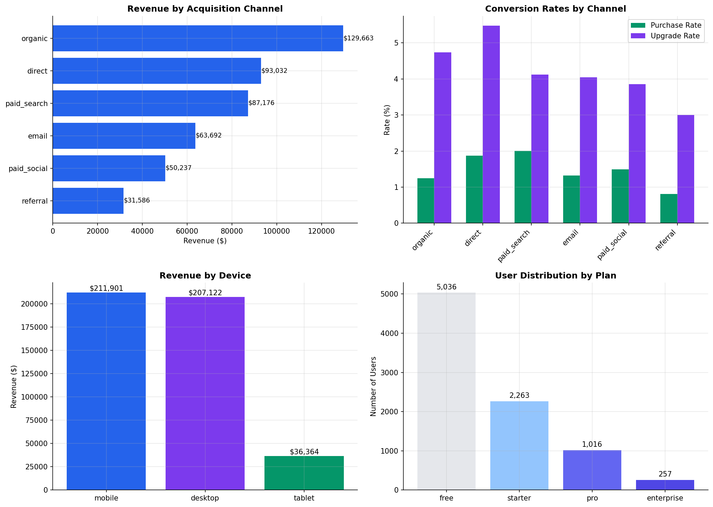

<p align="center">
  
</p>

<h1 align="center">📊 Product Analytics & Experimentation Platform</h1>

<p align="center">
  <strong>End-to-End Data Analytics Portfolio </strong>
</p>

<p align="center">
  <a href="#-live-demo">
    
  </a>
</p>

<p align="center">
  
  
  
  
  
</p>


---

## 🎯 Project Overview

This project demonstrates a **production-grade product analytics platform** covering:

| Component | Description |
|:----------|:------------|
| ✅ **Event Data Modeling** | Star Schema with Fact & Dimension Tables |
| ✅ **Funnel Analysis** | Drop-off identification & optimization |
| ✅ **Cohort Retention** | Weekly retention heatmaps & curves |
| ✅ **A/B Testing** | Statistical analysis with chi-square tests |
| ✅ **Metrics Framework** | North Star, Supporting & Guardrail metrics |
| ✅ **Executive Dashboard** | Interactive React dashboard with recommendations |

---

## 🏆 Key Business Results

<table>
<tr>
<td align="center" width="25%">
<h3>+51.5%</h3>
<strong>Conversion Lift</strong>
<br><sub>A/B test checkout redesign</sub>
</td>
<td align="center" width="25%">
<h3>$454K</h3>
<strong>Total Revenue</strong>
<br><sub>90-day analysis period</sub>
</td>
<td align="center" width="25%">
<h3>90.4%</h3>
<strong>Drop-off Found</strong>
<br><sub>Checkout friction identified</sub>
</td>
<td align="center" width="25%">
<h3>30.4%</h3>
<strong>Week 1 Retention</strong>
<br><sub>Above 20% benchmark</sub>
</td>
</tr>
</table>

---

## 🖥️ Live Demo

**Open `index.html` in your browser to see the interactive dashboard!**

Or deploy to GitHub Pages for a live URL.

---

## 📸 Dashboard Screenshots

### Executive Overview


<details>
<summary><strong>📊 Click to see all visualizations</strong></summary>

### Conversion Funnel Analysis


### Cohort Retention Heatmap


### A/B Test Results


### Channel & Segment Performance


### Guardrail Metrics


</details>

---

## 📁 Project Structure

```
📦 product-analytics-platform/
│
├── 📄 index.html                     # Interactive React Dashboard
├── 📄 README.md                      # This file
├── 📄 product_analytics_workbook.xlsx # Excel Report (5 sheets)
│
├── 📂 screenshots/                   # All Visualizations
│   ├── banner.svg
│   ├── 01_executive_dashboard.png
│   ├── 02_funnel_analysis.png
│   ├── 03_cohort_retention.png
│   ├── 04_ab_test_results.png
│   ├── 05_segmentation.png
│   └── 06_guardrail_metrics.png
│
├── 📂 data/                          # Generated Datasets
│   ├── dim_users.csv                 # 10,000 users
│   ├── fact_events.csv               # 156,430 events
│   ├── dim_sessions.csv              # 36,543 sessions
│   └── ab_test_assignments.csv       # 18,505 test assignments
│
└── 📂 source_code/                   # Complete Source Code
    ├── 1_generate_data.py            # Data generation script
    ├── 2_run_analysis.py             # Analysis & visualizations
    ├── 3_create_excel.py             # Excel automation
    ├── 4_sql_queries.sql             # 20+ SQL queries
    ├── 5_dashboard.jsx               # React dashboard component
    ├── requirements.txt              # Python dependencies
    └── run_project.sh                # One-click execution
```

---

## 🛠️ Tech Stack

| Category | Technologies |
|:---------|:-------------|
| **Data Processing** | Python, Pandas, NumPy |
| **Statistical Analysis** | SciPy (Chi-square, Z-tests, P-values) |
| **Visualization** | Matplotlib, Seaborn, Recharts |
| **Dashboard** | React 18, Tailwind CSS |
| **Database** | PostgreSQL-compatible SQL |
| **Excel Automation** | openpyxl |

---

## 🚀 Quick Start

### Option 1: View Dashboard
```bash
# Just open in browser
open index.html
```

### Option 2: Run Analysis Locally
```bash
# Install dependencies
pip install pandas numpy matplotlib seaborn scipy openpyxl

# Generate data & run analysis
cd source_code
python 1_generate_data.py
python 2_run_analysis.py
python 3_create_excel.py
```

### Option 3: Deploy to GitHub Pages
1. Push this repo to GitHub
2. Go to Settings → Pages
3. Select Branch: main, Folder: / (root)
4. Your dashboard will be live at `https://YOUR_USERNAME.github.io/REPO_NAME/`

---

## 📊 Data Model (Star Schema)

```
                         ┌─────────────────────┐
                         │     dim_users       │
                         │─────────────────────│
                         │ • user_id (PK)      │
                         │ • signup_date       │
                         │ • acquisition_channel│
                         │ • device, country   │
                         │ • plan              │
                         └──────────┬──────────┘
                                    │
                                    │ 1:N
                                    ▼
┌─────────────────┐    ┌─────────────────────────┐    ┌─────────────────────┐
│  dim_sessions   │◄───│      fact_events        │───►│ ab_test_assignments │
│─────────────────│    │─────────────────────────│    │─────────────────────│
│ • session_id    │    │ • event_id (PK)         │    │ • test_id           │
│ • duration      │    │ • event_timestamp       │    │ • user_id           │
│ • pages_viewed  │    │ • event_type            │    │ • variant           │
│ • conversions   │    │ • page, device, value   │    │ • assignment_date   │
└─────────────────┘    └─────────────────────────┘    └─────────────────────┘
```

---

## 📈 Analysis Results

### 1️⃣ Conversion Funnel

| Stage | Users | Rate | Drop-off |
|:------|------:|-----:|:--------:|
| Page View | 8,572 | 100% | - |
| Feature Engagement | 5,989 | 69.9% | 🟡 30.1% |
| Add to Cart | 3,708 | 43.3% | 🟡 38.1% |
| Begin Checkout | 1,330 | 15.5% | 🟠 64.1% |
| **Purchase** | **128** | **1.5%** | 🔴 **90.4%** |

> **💡 Insight:** 90.4% checkout drop-off = biggest revenue opportunity

---

### 2️⃣ Cohort Retention

| Week | Retention | Status |
|:----:|:---------:|:------:|
| 0 | 16.7% | ⚠️ Below target |
| 1 | 30.4% | ✅ Above benchmark |
| 4 | 28.6% | ✅ Stable |
| 8+ | ~28% | ✅ Long-term |

> **💡 Insight:** Focus on Week 0 → Week 1 activation

---

### 3️⃣ A/B Test Results

| Test | Variant | Lift | P-Value | Decision |
|:-----|:--------|:----:|:-------:|:--------:|
| Checkout Redesign | Treatment | **+51.5%** | 0.053 | 🟢 **SHIP** |
| Pricing Page | Variant B | +39.7% | 0.099 | 🟡 Continue |

---

### 4️⃣ Channel Performance

| Channel | Conv. Rate | Recommendation |
|:--------|:----------:|:---------------|
| **Paid Search** | **2.00%** | 🟢 Scale +20% |
| Direct | 1.88% | Nurture |
| Paid Social | 1.50% | Test creatives |
| Organic | 1.24% | Maintain |

---

## 📝 SQL Query Examples

<details>
<summary><strong>🔍 Click to see SQL examples</strong></summary>

### DAU/WAU Stickiness
```sql
SELECT 
    event_date,
    COUNT(DISTINCT user_id) AS dau,
    COUNT(DISTINCT user_id) OVER (
        PARTITION BY DATE_TRUNC('week', event_date)
    ) AS wau,
    ROUND(dau::DECIMAL / wau * 100, 2) AS stickiness
FROM fact_events
GROUP BY event_date;
```

### Cohort Retention
```sql
WITH cohorts AS (
    SELECT user_id, DATE_TRUNC('week', signup_date) AS cohort
    FROM dim_users
)
SELECT 
    cohort,
    week_number,
    ROUND(active_users::DECIMAL / cohort_size * 100, 2) AS retention
FROM retention_data;
```

### A/B Test Analysis
```sql
SELECT 
    variant,
    COUNT(DISTINCT user_id) AS users,
    SUM(CASE WHEN converted THEN 1 ELSE 0 END) AS conversions,
    ROUND(conversions::DECIMAL / users * 100, 3) AS conv_rate
FROM ab_test_results
GROUP BY variant;
```

</details>

---

## 🎯 Executive Recommendations

| Priority | Action | Impact |
|:--------:|:-------|:-------|
| 🔴 P0 | Ship Checkout Redesign | +$75K-$120K/year |
| 🔴 P0 | Fix Mobile UX | +35% mobile conversion |
| 🟠 P1 | Abandoned Cart Emails | -15% abandonment |
| 🟠 P1 | Onboarding Flow | +50% activation |
| 🟡 P2 | Scale Paid Search | +$20K/month |

---


## 📄 Files Included

| File | Description |
|:-----|:------------|
| `index.html` | Interactive React dashboard (open in browser) |
| `product_analytics_workbook.xlsx` | Excel report with 5 sheets |
| `data/*.csv` | 4 CSV files (users, events, sessions, A/B tests) |
| `source_code/*.py` | 3 Python scripts |
| `source_code/*.sql` | 20+ SQL queries |
| `source_code/*.jsx` | React dashboard component |
| `screenshots/*.png` | 6 visualization images |

---

## 📄 License

MIT License - Free to use for your portfolio!

---

<p align="center">
  <strong>⭐ Star this repo if it helped you!</strong>
</p>

<p align="center">
  <sub>Built for Senior Data Analyst / Product Analyst roles at FAANG companies</sub>
</p>
